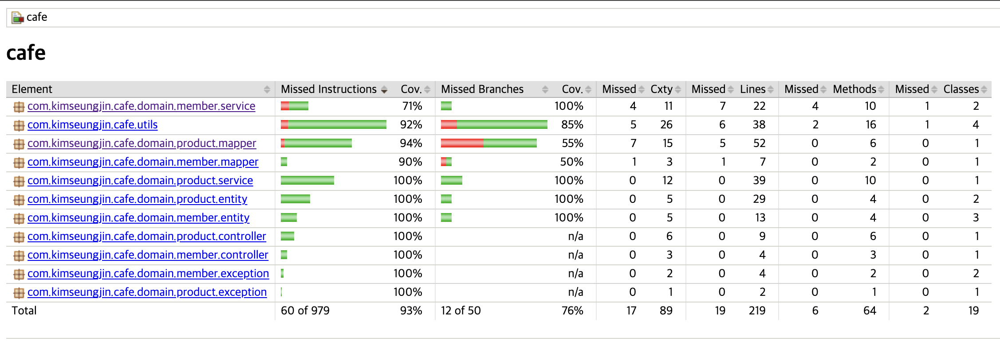

# cafe
### _카페 메뉴 관리 서비스_

[todo 문서](./docs/todo.md)

## 구현시 고려 사항

*각 토글을 클릭하시면 설명이 적혀있습니다.

<details>
<summary>초성 검색을 위한 초성 저장 및 인덱스 적용</summary>
<div markdown="1">

- 초성을 따로 저장하여 검색시에 초성으로 검색하도록 구현
- 초성 검색에는 순서가 있을때 유리한 B-Tree 인덱스를, 전체 검색에는 문자열 검색에 유리한 Full Text 인덱스를 적용하여 검색 성능을 향상

</div>
</details>

- [예시: V1__init.sql](./src/main/resources/db/migration/V1__init.sql)

<details>
<summary>Redis를 통한 jwt 토큰 블랙리스트 구현</summary>
<div markdown="1">

- ttl을 통해 만료된 토큰을 자동으로 삭제하도록 구현
- 인터페이스를 상속받아 구현하여 추후 다른 저장소로의 변경과 테스트에 용이하도록 구현

</div>
</details>

- [예시: RedisBlackListUtils.java](./src/main/java/com/kimseungjin/cafe/utils/RedisBlackListUtils.java)

<details>
<summary>연관관계 엔티티 대신 id만 사용</summary>
<div markdown="1">

- Product 엔티티가 Member 보다는 id를 UUID로만 갖도록 구현
- Member의 id를 통해 Product를 조회하는 로직 외에는 Member 정보가 Product에서 사용되지 않음

</div>
</details>

- [예시: Product.java](./src/main/java/com/kimseungjin/cafe/domain/product/entity/Product.java)

<details>
<summary>암호화 및 복호화 Converter 사용으로 자동화</summary>
<div markdown="1">

- DB에 저장시 암호화 Converter로 자동화
- 조회시 자동으로 복호화되어 조회되도록 구현

</div>
</details>

- [예시: EncryptConverter.java](./src/main/java/com/kimseungjin/cafe/config/converter/EncryptConverter.java)
- [예시: LoginCredentials.java](./src/main/java/com/kimseungjin/cafe/domain/member/entity/LoginCredentials.java)

<details>
<summary>AOP 로깅</summary>
<div markdown="1">

- aop를 사용하여 로깅을 적용하여 공통 관심사를 분리하여 처리

</div>
</details>

- [예시: LogIntroduction.java](./src/main/java/com/kimseungjin/cafe/aspect/LogIntroduction.java)

<details>
<summary>정렬된 uuid pk와 binary 타입으로 사용</summary>
<div markdown="1">

- 인덱스가 자동으로 생성되는 pk에 ulid 라이브러리를 통해 정렬된 uuid 사용 및 binary(16) 으로 저장하여 보다 적은 저장공간 사용

</div>
</details>

- [예시: Member.java](./src/main/java/com/kimseungjin/cafe/domain/member/entity/Member.java)

<details>
<summary>embedded BaseTime</summary>
<div markdown="1">

- 상태를 위한 상속 보다는 행동을 상속받도록 구현
- 커스텀 EntityListener와 인터페이스 상속을 통해 자동으로 created_at, updated_at, deleted_at 정보 저장

</div>
</details>

- [예시: global/audit package의 모든 파일](/src/main/java/com/kimseungjin/cafe/global/audit/)
- [예시: Member.java](./src/main/java/com/kimseungjin/cafe/domain/member/entity/Member.java)

<details>
<summary>repository 추상화</summary>
<div markdown="1">

- repository 추상화를 통해 JpaRepository의 모든 기능을 외부에 노출하지 않도록 구현
- 추후 다른 기술 도입에 용이한 Jpa에 종속적이지 않은 설계

</div>
</details>

- [예시: MemberRepository.java](./src/main/java/com/kimseungjin/cafe/domain/member/repository/MemberRepository.java)

<details>
<summary>커버리지 80퍼센트 목표의 DCI 패턴의 테스트 코드 작성</summary>
<div markdown="1">

- controller, service, repository에 대한 테스트 코드 작성하여 커버리지 93퍼센트 달성
- 테스트 코드 작성시 DCI 패턴을 사용하여 테스트 코드의 가독성과 유지보수성 향상

</div>
</details>

## 사용 컴포넌트
### 기본 컴포넌트
```
- Spring Boot (ver 3.2.2)
    - java 17
    - gradle
    - spring-data-jpa
    - jjwt
- MySQL:5.7
- Jib && docker-compose
```

### 추가 사용 컴포넌트
```
- Spring Boot
    - spring security: 인증
    - spring validation: dto 검증
    - ulid creator: pk를 정렬된 uuid로 사용하기 위함
- swagger: api 문서화
- Flyway
- Jacoco
- Redis
- Github Actions
    - cafe-ci-build.yml: 테스트와 jib 빌드 자동화
    - cafe-reformat-code.yml: google java format 자동 적용
```

## 실행 방법
1-1. 직접 빌드 후 실행
```
docker-compose up
```
1-2. 미리 빌드해둔 Jib 이미지로 실행
```
docker-compose -f docker-compose.jib.yml up
```
1-3. 백엔드 서버 제외한 도커 실행 (백엔드 서버는 인텔리제이로 실행)
```
docker-compose -f docker-compose.dev.yml up
```

### 실행시 유의 사항
- MySQL의 헬스체크 이후 Backend가 실행되어 처음 실행시 약간의 딜레이가 있습니다.
- Bearer Token을 사용해야 하며, 로그인 api 의 response의 accessToken을 사용하시면 됩니다.

## Connection 정보
### Swagger
```
http://localhost:8080/api/swagger-ui/index.html
```
### MySQL
```
host: localhost
port: 3306
root password: 1234
username: admin
password: 1234
```

## Jacoco 실행 방법
1. 인텔리제이에서 build.gradle 파일의 line 103에 위치한 jacocoTestReport를 실행합니다.


2. 다음 경로에 생성된 index.html을 확인합니다.

[./build/reports/jacoco/test/html/](./build/reports/jacoco/test/html/)

## 실행 예시
### Database ERD

*FK 제약조건이 걸려있지 않지만 이해를 돕기 위해 표시해뒀습니다.

### Jacoco Code Coverage


### Swagger API Docs


## ETC
- 민감한 정보의 환경변수도 번거로운 작업을 줄이기 위해 그대로 커밋하였습니다.
